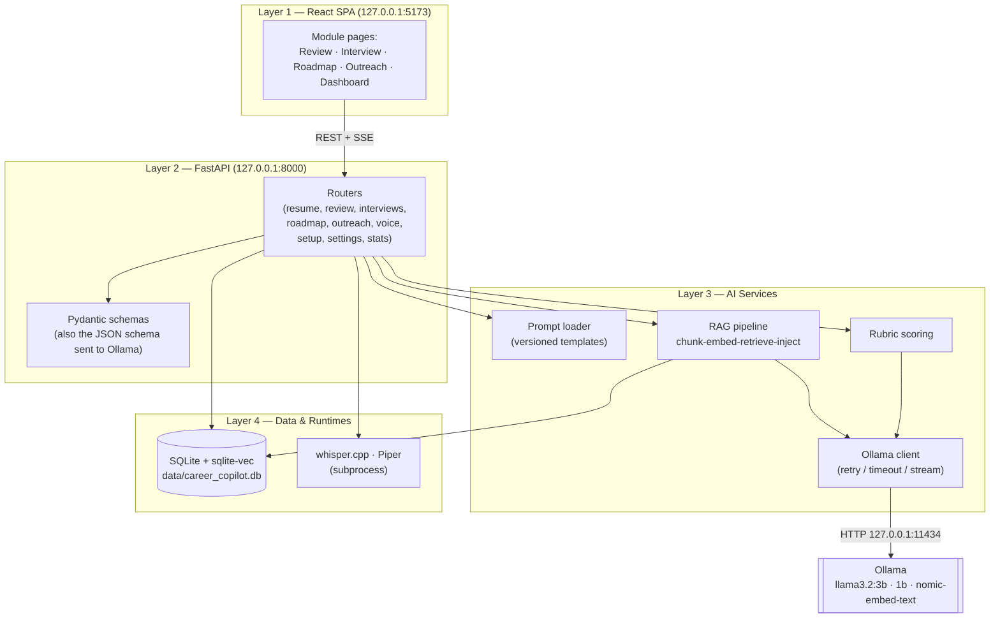
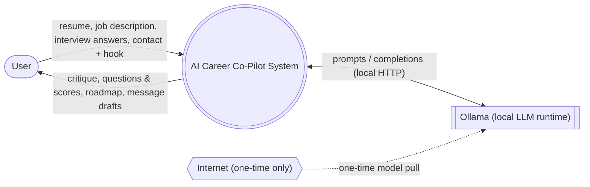
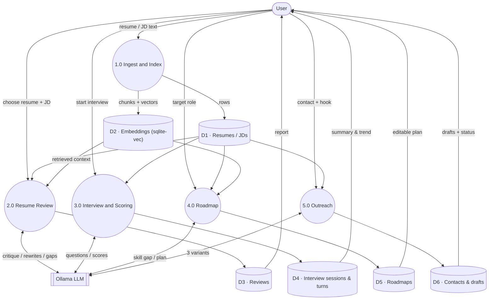
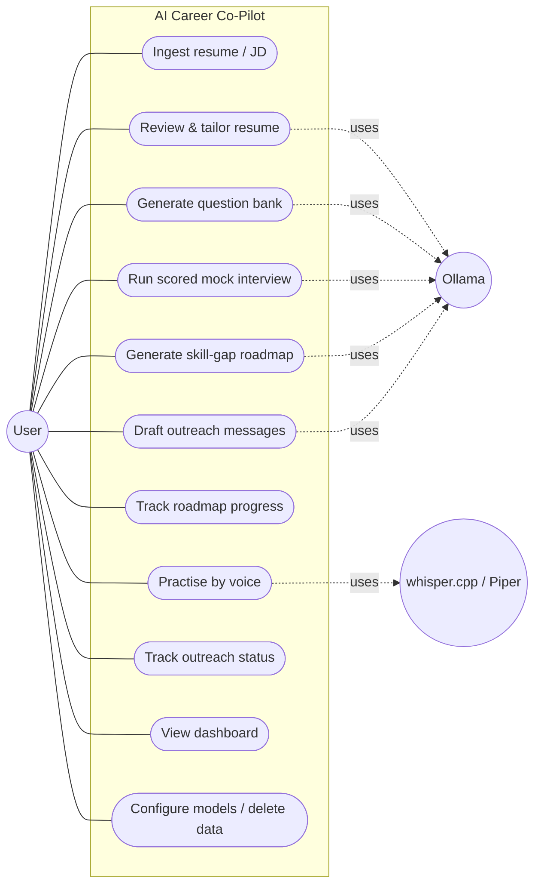
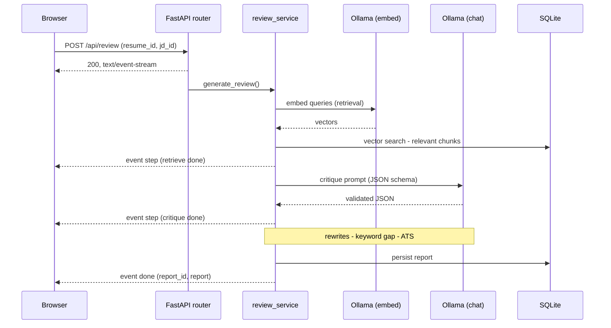

# System Architecture — AI Career Co-Pilot

Academic design documentation (SOW §6, §10). All diagrams are Mermaid and render
in GitHub, VS Code, and most black-book tooling.

---

## 1. Architectural style

A **four-layer, locally-hosted web application**. The browser talks to a single
FastAPI backend, which orchestrates a local LLM (Ollama) and a single SQLite
file. Nothing is exposed to the network — both servers bind to `127.0.0.1`.

| Layer | Responsibility | Key code |
|-------|----------------|----------|
| **1 · Presentation** | React SPA; talks to the backend over REST + Server-Sent Events. No external CDNs. | `frontend/src/` |
| **2 · API / Orchestration** | FastAPI routers per module; Pydantic request/response validation; every LLM feature returns schema-validated JSON. | `backend/app/routers/`, `schemas/` |
| **3 · AI Services** | Prompt-template engine, RAG pipeline (chunk → embed → retrieve → inject), rubric scoring, and the Ollama client wrapper (retry, timeout, streaming). | `backend/app/services/`, `llm/` |
| **4 · Data & Local Runtimes** | SQLite via SQLAlchemy + `sqlite-vec` for embeddings. whisper.cpp & Piper as subprocesses. | `backend/app/models/`, `db.py` |

### Component diagram

---

## 2. Data-Flow Diagram — Level 0 (context)

The whole system as one process, showing what crosses the boundary. Only the
**one-time model download** ever touches the internet.

---

## 3. Data-Flow Diagram — Level 1

The system decomposed into processes and data stores. Every arrow stays on the
machine except the dashed one-time pull.

---

## 4. Use-Case Diagram

---

## 5. Request lifecycle — a streamed review (representative sequence)

Long AI operations stream progress as Server-Sent Events so the UI never looks
frozen. This is the same pattern used by review, roadmap, outreach, and question
generation.

---

## 6. Design principles (defensible in the viva)

- **Privacy by architecture** — loopback-only binding; the only outbound call is
  the one-time model pull. This is a structural guarantee, not a policy.
- **Grounded, not generic** — RAG injects the user's actual resume/JD text into
  every prompt, so outputs cite real content (SOW §6.2).
- **Structured output** — Pydantic models *are* the JSON schema handed to Ollama,
  so the model is constrained to valid output; one repair retry handles the rest.
- **Determinism where it matters** — scoring runs at temperature 0.2 for ±1-point
  repeatability; summaries are computed arithmetically, not by the model.
- **Model tiering** — `llama3.2:3b` for reasoning, `llama3.2:1b` for fast question
  generation, `nomic-embed-text` for retrieval; all under 4B for an 8 GB machine.
- **Graceful degradation** — a down Ollama, a missing model, or absent voice
  binaries are reported states with fix hints, never crashes.
