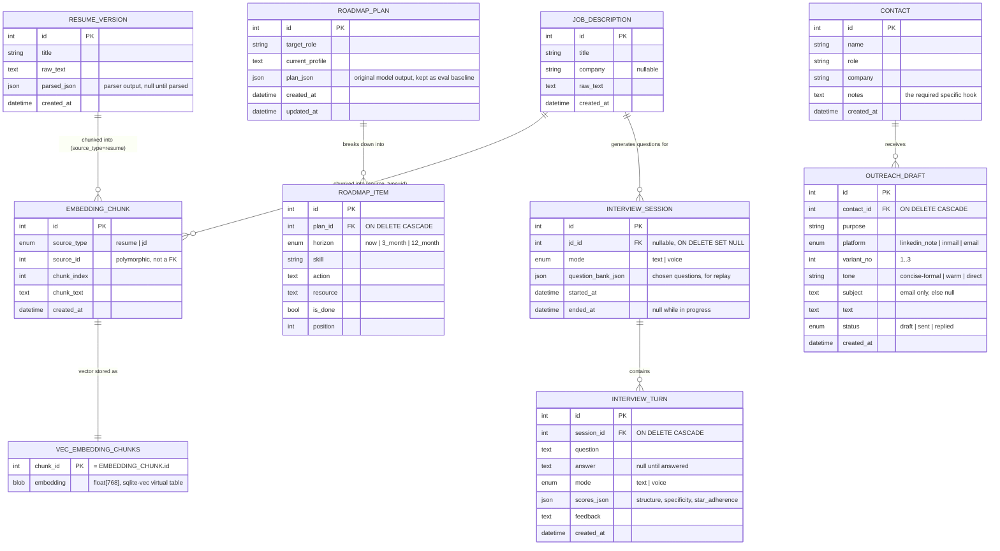

# Entity-Relationship Diagram — AI Career Co-Pilot

Academic deliverable for **Phase 0** (SOW §10, "Design Diagrams").
Schema source of truth: `backend/app/models/`.

Database: a single SQLite file at `data/career_copilot.db`, with the
`sqlite-vec` extension providing vector search inside the same file.

---

## ER Diagram

---

## Design decisions worth defending in the viva

**1. Why is the embedding split across two tables?**
`sqlite-vec` stores vectors in a *virtual table*, which SQLAlchemy's ORM cannot
describe. `EMBEDDING_CHUNK` therefore holds the readable metadata and text,
while `VEC_EMBEDDING_CHUNKS` holds only the 768 floats. They share a primary
key, so a similarity search returns `chunk_id` values that join straight back.
The vector is never read by the application — it is only ever matched against.

**2. Why is `EMBEDDING_CHUNK.source_id` not a foreign key?**
A chunk can come from either a resume or a job description. A single column
cannot reference two tables, so `(source_type, source_id)` is a polymorphic
reference and the service layer enforces integrity on delete
(`vector_store.delete_for_source`). The alternative — two nullable FK columns —
adds a column that is always null and complicates every query.

**3. Why does deleting a JD not delete its interviews?**
`INTERVIEW_SESSION.jd_id` is `ON DELETE SET NULL`, everything else is
`CASCADE`. Practice history is the user's own work; it should outlive the job
posting it was generated from. Deleting a contact, by contrast, *should* remove
their drafts — those have no meaning without the person.

**4. Why keep both `plan_json` and `ROADMAP_ITEM` rows?**
`plan_json` preserves the model's original output verbatim, which the Phase 5
evaluation harness needs to compare prompt versions. `ROADMAP_ITEM` is the
user-editable copy — ticking off one action is a single row update rather than a
read-modify-write of an entire JSON document. SOW §6.3 names both entities.

**5. Why is `mode` stored on the turn as well as the session?**
SOW §12 requires proving that the same answer scores within ±1 rubric point
whether spoken or typed. That comparison is only measurable if delivery mode is
recorded per answer. It also allows a single session to mix both.

**6. How are enums stored when SQLite has no ENUM type?**
As `VARCHAR` with a `CHECK` constraint, generated by SQLAlchemy's
`Enum(..., native_enum=False)`. Invalid values are rejected by the database, not
merely by application code — verified in `tests/test_models.py`.

**7. What makes the SQL injection-safe?**
Every statement goes through SQLAlchemy, which parameterises by construction.
The handful of raw statements needed for the virtual table use bound parameters
(`:chunk_id`), never string formatting. This satisfies SOW §7,
"parameterized SQL throughout".

---

## Data-flow note for the DFD

Only two entities ever receive data from outside the machine:
`RESUME_VERSION.raw_text` (a PDF or pasted text) and `JOB_DESCRIPTION.raw_text`
(pasted text). Everything else is derived locally by the model. No table stores
an API key, a credential, or a remote identifier, because there is no remote
service — which is the schema-level expression of the project's privacy claim.
